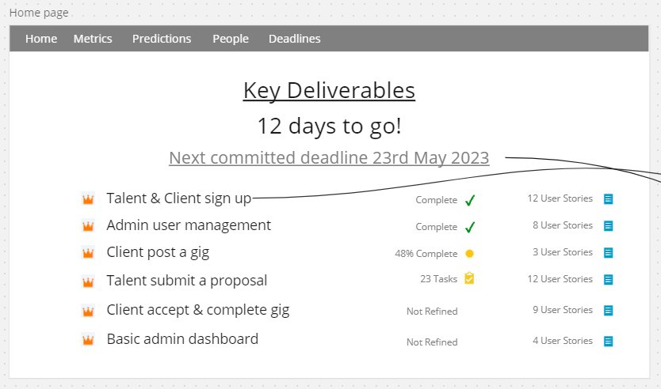
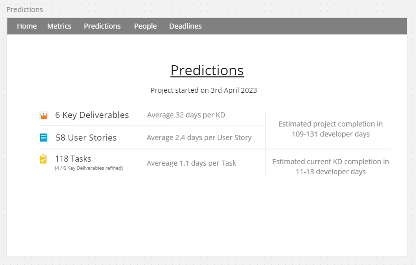

# Estimatey
### Takes the "Arrrrrrgh" out of software project planning and estimation.

Estimatey hooks into the tools that you already use** and provides insights that you need to help with project planning and estimation.

** provided that they are [Azure DevOps](https://azure.microsoft.com/en-gb/products/devops) and [Float](https://www.float.com/time-tracking/) :stuck_out_tongue_closed_eyes:

## Limitations
- When work items are deleted in DevOps this is not reflected in the Estimatey work item cache.
This is because the work item revisions (annoyingly) doesn't tell us when work items are deleted.
It does tell use when work items are restored from the recycle bin though!!
- It keeps the same token for ever so will probably fall over after about 1 hour at the moment...

## Road Map
- :construction: Write service to sync work items from DevOps including features, user stories, tasks and their tags.
- Write service to sync work item relationships from DevOps.
- Project ticket overview page

- Write service to sync time sheets from Float.
- Basic predictions page

## Future Scope
- Warnings when invalid work item states are found e.g. Tasks or User Stories without a parent
or a User Story that is completed when all it's child tasks are not completed.
- Track date set to in progress and date completed to allow guestimating time to complete work items.